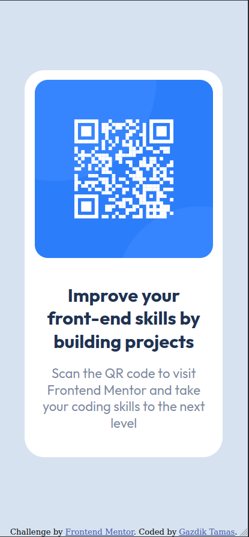

# Frontend Mentor - QR code component solution

This is a solution to the [QR code component challenge on Frontend Mentor](https://www.frontendmentor.io/challenges/qr-code-component-iux_sIO_H). Frontend Mentor challenges help you improve your coding skills by building realistic projects. 

## Table of contents

- [Overview](#overview)
  - [Screenshot](#screenshot)
  - [Links](#links)
- [My process](#my-process)
  - [Built with](#built-with)
  - [What I learned](#what-i-learned)
  - [Continued development](#continued-development)
  - [Useful resources](#useful-resources)
- [Author](#author)
- [Acknowledgments](#acknowledgments)


## Overview

### Screenshot




### Links

- Solution URL: [https://kbmdude.github.io/](https://kbmdude.github.io/)
- Live Site URL: [https://kbmdude.github.io/](https://kbmdude.github.io/)


## My process

### Built with

- Semantic HTML5 markup
- Cascading Style Sheets 3
- Flexbox


### What I learned

To create a somewhat responsive design, I used media-query. That was the first time I used one since I started learning front-end development, and I'm so glad it does what I needed from it.

```css
@media (max-width: 900px) {
    .container {
        width: 80%;
    }

    h1 {
        font-size: 1.25rem;
    }

    p {
        font-size: 1rem;
    }
}
```

I also learned to use relative units such as `rem` for font sizing, instead of hardcoding pixels for them.


### Continued development

The design is not as responsive as I'd like it to be, there are some width-height ratios where the site just doesn't look the way I want it, so I'll definitely look into responsive design more.


### Useful resources

- [W3Schools CSS Media Queries](https://www.w3schools.com/css/css3_mediaqueries.asp) - Great starting content with media queries.


## Author

- Frontend Mentor - [@kbmdude](https://www.frontendmentor.io/profile/kbmdude)


## Acknowledgments

I really liked this challenge, and I would like to thank for this pleasant experience to frontendmentor.io for providing all necessary information, some great tips, design concepts and the assets required for the project up front, so I didn't have to figure out stuff on my own, but instead could focus on the building part.